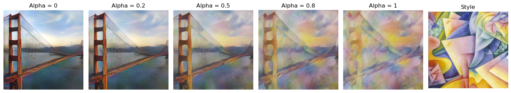

<<<<<<< HEAD
# GMMWStyleTransfer
=======
# GMM Wasserstein Style Transfer

GMM Wasserstein Style Transfer is a method for style transfer using optimal transport between GMM distributions where the transport plan is itself a GMM. We are given as inputs a content image and a style image and the goal is to create an image with the contents of the first image and the style from the second image. To do this, we extract the features of both images using an image decoder and view the features as samples of a distribution (one for the content image and one for the style image) that we estimate with a GMM. We then transform the content image features GMM via optimal transport to the style image features GMM. We then decode the features obtained to get our output image.

This work is built using the results of three papers :
- [A Wasserstein-type distance in the space of Gaussian Mixture Models](https://hal.archives-ouvertes.fr/hal-02178204)
- [Universal Style Transfer via Feature Transforms](https://arxiv.org/pdf/1705.08086.pdf)
- [Wasserstein Style Transfer](https://arxiv.org/pdf/1905.12828)

## Examples

>>>>>>> 3f38b68 (Added images, code and notebook)
>>>>>>> 48afd0f (first commit)
